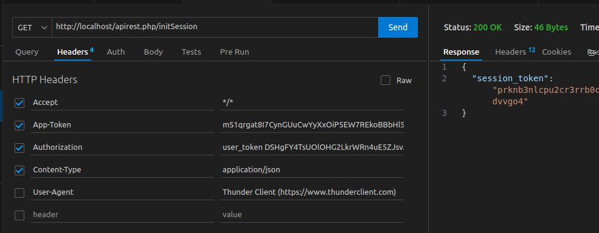
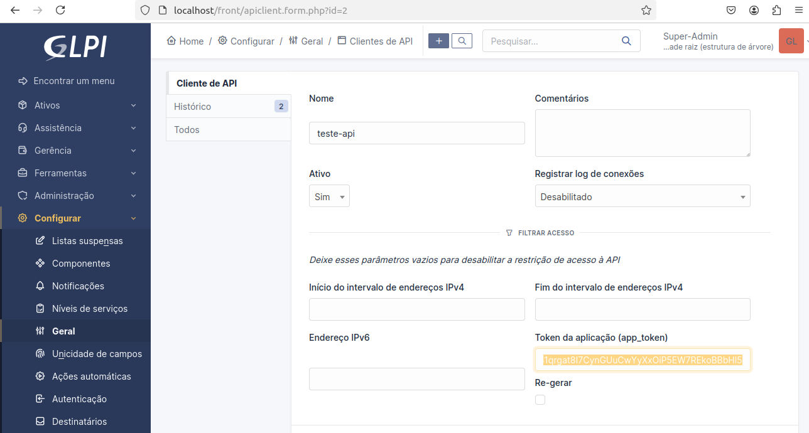
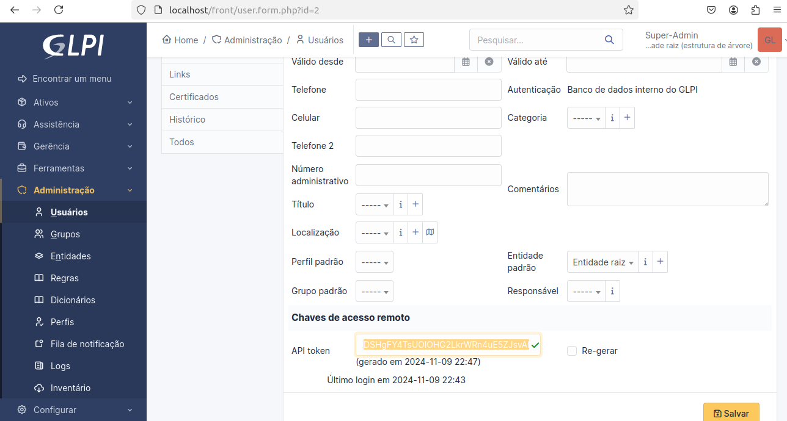
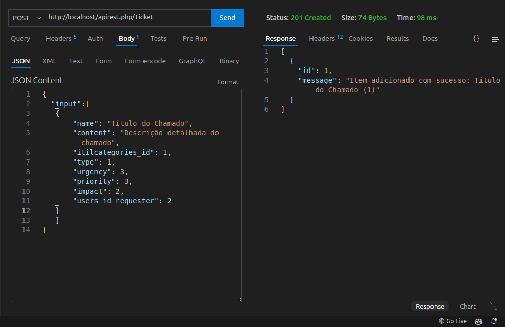
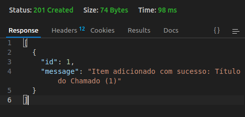

# Projeto para criação de Tickets via API GLPI

## Iniciando o container glpi

- Dar permissão para o mysql escrever nos volumes `sudo chmod -R 777 ./glpi_db_*` ou dê permissão apenas paro mysql (percona) `sudo chown -R 1001:1001 ./glpi_db_*lib*`

- Entrar no container:

```bash
docker exec -it glpi_app /bin/bash
```

- Dar permissões para as pastas do glpi:

```bash
glpi-console glpi:database:install -L pt_BR -Hdb-glpi-10 -dglpi -uglpi -pGLP1_MySQL@10 --no-telemetry --force -n && mv /usr/share/glpi/install /usr/share/glpi/install_ori && rm -rf /var/log/glpi/* && chown -R apache:apache /usr/share/glpi/marketplace/ && chown -R apache:apache /var/lib/glpi/files && chown -R apache:apache /var/log/glpi && chown -R apache:apache /var/lib/glpi/files/data-documents && chown -R apache:apache /etc/glpi && chown -R apache:apache /var/lib/glpi/files/_plugins && chown -R apache:apache /backup  && chown -R apache:apache /usr/share/glpi/marketplace 
```


## Comandos para o host:
- Remover todos os volumes: `rm -r -f glpi_*` 
- Remover todos os volumes criados em **/var/lib/docker/volumes**: `docker volume rm glpi_db_lib` , `docker volume rm glpi_db_lib` e `docker volume rm glpi_db_log`

<br>
<br>
<br>

# API GLPI

### Buscando o `session_token`
End-point incial, usado para buscar o session_token (token de sessão)  para criar um novo ticket (chamado).



- Url: `http://localhost/apirest.php/initSession`
- Método: `GET`
- Headers:
  - App-Token: 

  - Authorization: `user_token +espaço em branco +{valor_fornecido_pelo_glpi}`  
O **user_token** no início é **obrigatório**

  - Retorno: `{
  "session_token": "rc1da4o3ime5d1cgmtv3rrhbhg"
}`


### Criar Chamado:

- Url: `http://localhost/apirest.php/Ticket`
- Método: `POST`
- Headers:
  - App-Token:  `valor do token criado em nas configurações gerais da API`
  - Authorization: `user_token +espaço em branco +{valor_fornecido_pelo_glpi}`  
  - Session-Token: `Valor recuperado no end-point http://localhost/apirest.php/initSession `  
  - Content-Type: `application/json`
- Body:
```json
{
  "input":[
   {
       "name": "Título do Chamado",
       "content": "Descrição detalhada do chamado",
       "itilcategories_id": 1, // encontre os valores na tabela glpi_itilcategories
       "type": 1,
       "urgency": 3,
       "priority": 3,
       "impact": 2,
       "users_id_requester": 2, // usuário que abre o chamado;
       "users_id_recipient": 5 // usuário atribuído
   }
   ]
}
```

- Retorno:
```json
[
  {
    "id": 1,
    "message": "Item adicionado com sucesso: Título do Chamado (1)"
  }
]
```



# Links:

- Criar categorias: `http://localhost/front/itilcategory.php?`
  - mais: Observer o input de **técnico atribuído** e **filho de**